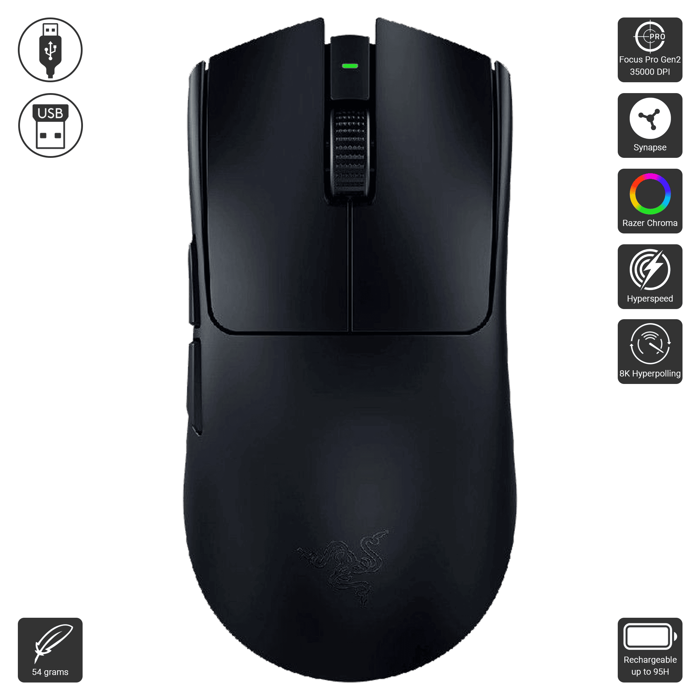
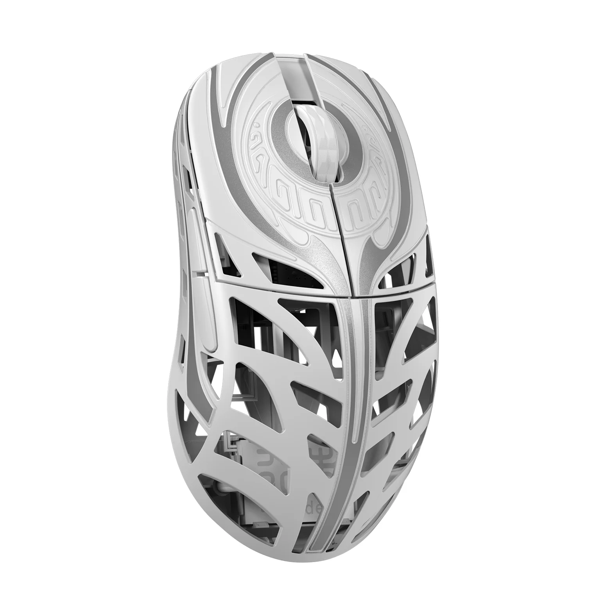
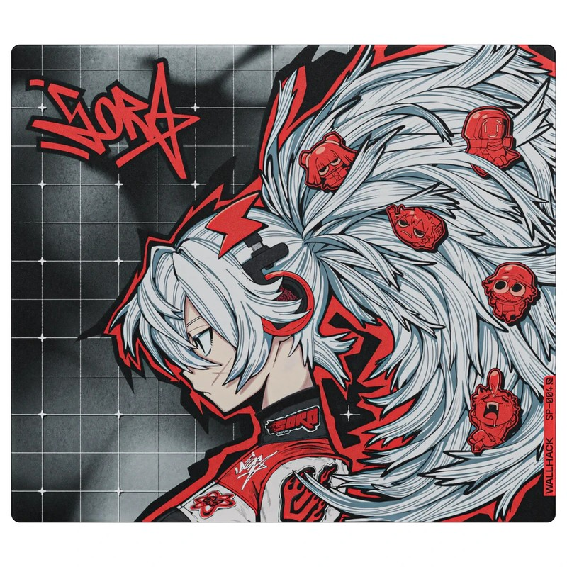
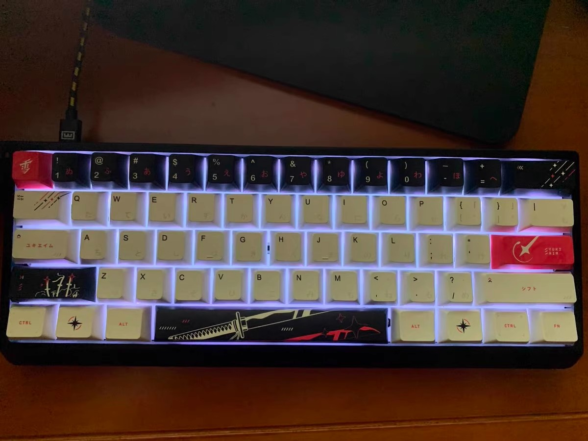
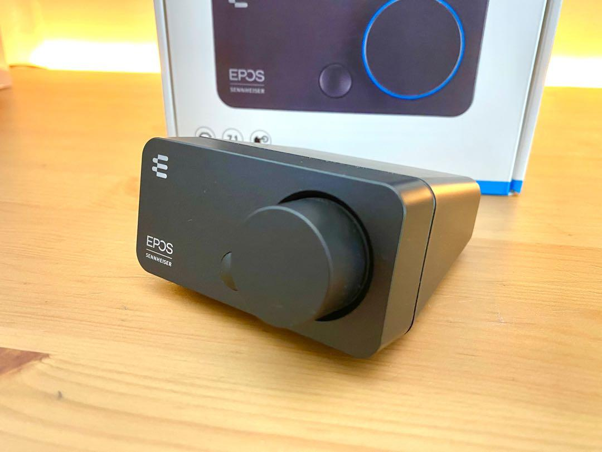
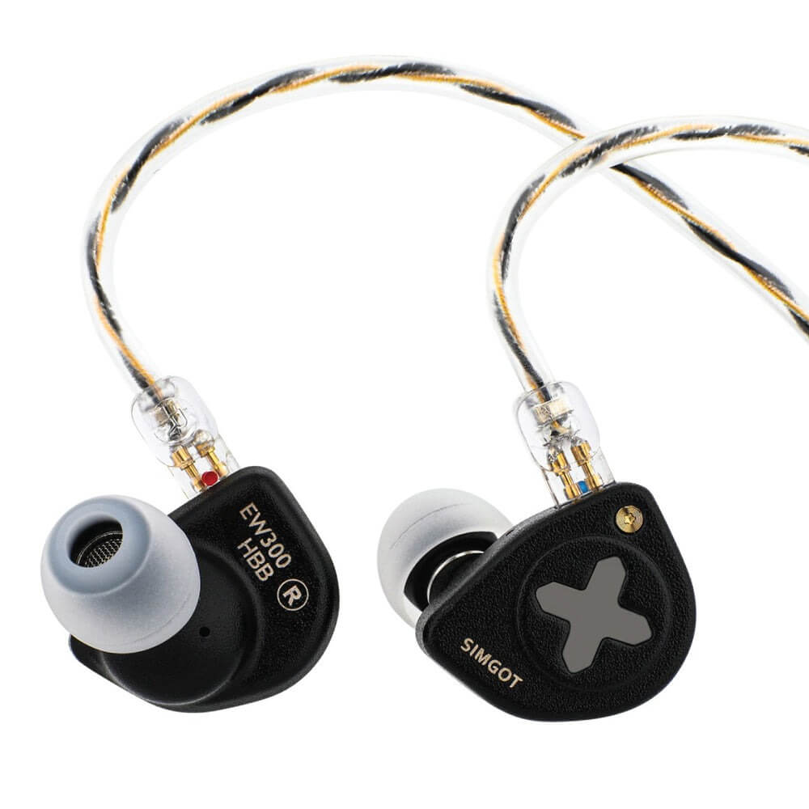
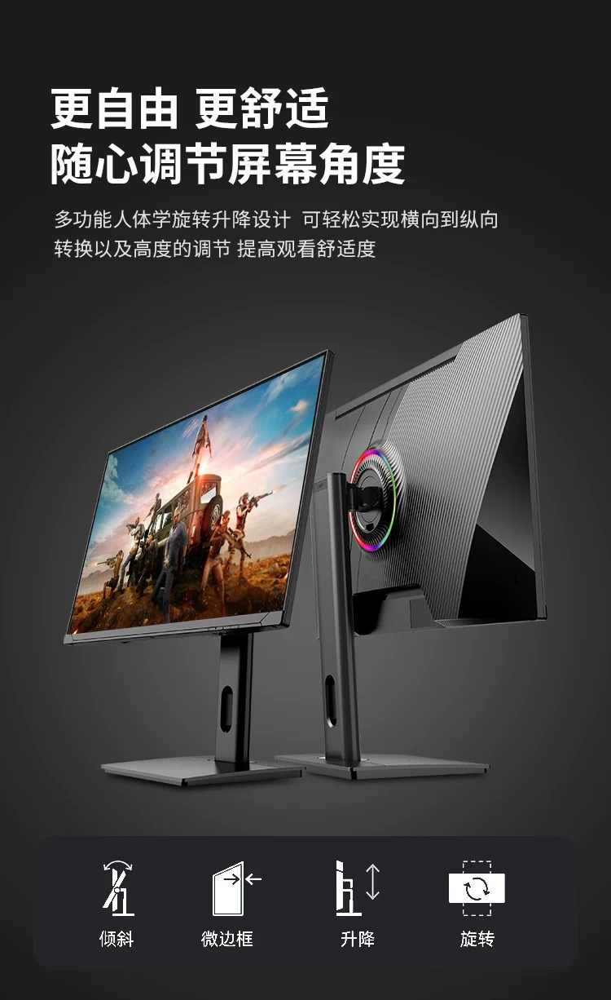

# KingOfNut.github.io
Project for introduction to HTML5 coursera
<!DOCTYPE html>
<html lang="vi">
<head>
  <meta charset="UTF-8">
  <title>Hẹ Hẹ Hẹ</title>
</head>
<body>

  <header>
    <h1>Chào mừng đến với trang web tự bợ bản thân</h1>
    <section>
      <h2>Ngahahahahahahahahaha</h2>
       
    </section>
  </header>

  <main>
    <section>
      <h2>Mình có sở thích như này</h2>
      <ul>
        <li>Đọc sách</li>
        <li>Chơi game</li>
        <li>Du lịch khắp mọi miền tổ quốc</li>
      </ul>
    </section>

    <section>
      <h2>Ước mơ của mình là trở thành vua cobac</h2>
    </section>

    <section>
      <h2>Hình ảnh về dàn setup của mình</h2>
       
    </section>
    
    <section>
      <h2>Gear mình đang dùng</h2>
      

  
  
Chuột Razer Viper V3 Pro

  
Giá khoảng: 4.000.000 VNĐ

    

  
  
Chuột WLmouse Strider

  
Giá khoảng: 4.000.000 VNĐ

      

  
  
WALLHACK SP-004 - Drift Sora Glass Mouse Pad

  
Giá khoảng: 6.000.000 VNĐ

      

  
  
 Mạch Venom 60he với full build case nhôm CNC

  
Giá khoảng: 6.000.000 VNĐ

      

  
  
 DAC EPOS Sennheiser GSX 300 7.1

  
Giá khoảng: 2.500.000 VNĐ

      

  
  
 Tai nghe Simgot EW300

  
Giá khoảng: 1.500.000 VNĐ

    

  
  
 Màn Hình SanV 430Hz

  
Giá khoảng: 9.000.000 VNĐ

    </section>

    <section>
      <h2>Một vài game mình đang chơi</h2>
      

      
      
<a href="https://playvalorant.com/vi-vn/" target="_blank">Valorant</a>

      

      
      
<a href="https://www.counter-strike.net/news" target="_blank">Counter Strike 2</a>

      

      
      
<a href="https://teamfighttactics.leagueoflegends.com/vi-vn/" target="_blank">Team Fight Tactics</a>

    </section>

    <section>
      <h2>Một vài nền tảng mạng xã hội mình đang hoạt động</h2>
      
Theo dõi mình tại <a href="https://www.facebook.com/CoMotChutNuaThoi" target="_blank">Facebook</a>

      
Theo dõi mình tại <a href="https://www.youtube.com/@NinymNe" target="_blank">Youtube</a>

      
Theo dõi mình tại <a href="https://www.tiktok.com/@af4xninym001?is_from_webapp=1&sender_device=pc" target="_blank">Tik Tok</a>

    </section>
  </main>

</body>
</html>
